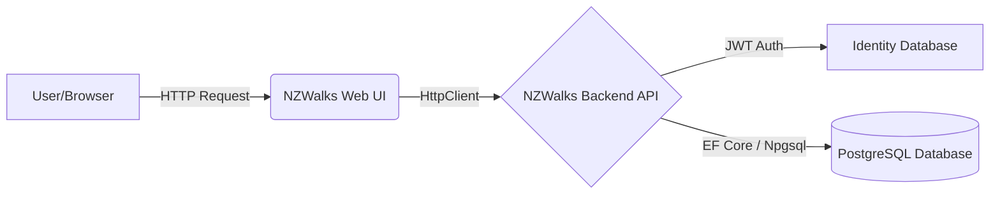

# Product Requirements Document (PRD): NZWalks Application

## 1. Project Overview and Objectives
The **NZWalks** application is a comprehensive web-based platform designed to manage and discover walking tracks across different regions in New Zealand. The system is split into a robust backend API service and a frontend user interface.

**Objectives:**
- Provide a scalable and secure backend RESTful API to manage Regions, Walks, Difficulties, and Images.
- Deliver an intuitive frontend web application for users to interact with the backend data.
- Demonstrate best practices in modern ASP.NET Core architecture, including Dependency Injection, Entity Framework Core (Code-First), JWT Authentication, and Global Exception Handling.

---

## 2. Architecture
The project employs a distributed client-server architecture consisting of two distinct applications:

1. **NZWALKS-ASP.NET Core (Backend API):** A RESTful Web API responsible for data persistence, business logic, authentication, and serving data via JSON.
2. **NZWALKSWEBUI (Frontend):** An ASP.NET Core MVC application acting as the presentation layer. It communicates with the backend API using `HttpClient`.

### Architecture Flow

### Folder Structure (Backend API)
- **Controllers/**: API Endpoints (e.g., `RegionsController`, `WalksController`).
- **Data/**: Entity Framework Core contexts (`NZWalksDbContext`, `NZWalksAuthDbContext`).
- **Models/Domain/**: Core domain entities representing database tables.
- **Models/DTO/**: Data Transfer Objects used to receive and send data.
- **Repositories/**: Interfaces and implementations for database operations (e.g., `ITokenRepository`).
- **Middlewares/**: Custom middleware (e.g., Global Exception Handler).
- **Images/**: Static folder for uploaded physical images.

---

## 3. Technology Stack

| Component | Technology | Rationale |
| :--- | :--- | :--- |
| **Backend Framework** | ASP.NET Core Web API (.NET) | High performance, cross-platform, robust DI container. |
| **Frontend Framework** | ASP.NET Core MVC (.NET) | Seamless integration with .NET ecosystem, server-side rendering for SEO and fast initial load. |
| **Database** | PostgreSQL | Open-source, highly reliable relational database. |
| **ORM** | Entity Framework Core | Simplifies database interactions using LINQ, enables Code-First migrations. |
| **Authentication** | ASP.NET Core Identity & JWT | Secure, stateless authentication suitable for REST APIs. |
| **Logging** | Serilog | Structured logging to track application behavior and errors. |
| **API Documentation**| Swagger & Scalar | Provides an interactive UI to explore and test API endpoints. |

---

## 4. Database Design and Schema
The application uses two separate database contexts to separate business data from authentication data.

### Business Data (`NZWalksDbContext`)
- **Region**: Represents a geographical area.
- **Difficulty**: Represents how hard a walk is (e.g., Easy, Medium, Hard).
- **Walk**: Represents a specific walking track. Belongs to a Region and has a Difficulty.
- **Image**: Stores metadata and file paths for uploaded images.

**Relationships:**
- A `Walk` has a one-to-many relationship with `Region` (A region has many walks).
- A `Walk` has a one-to-many relationship with `Difficulty` (A difficulty level is assigned to many walks).

### Authentication Data (`NZWalksAuthDbContext`)
- Utilizes the standard ASP.NET Core Identity tables (`AspNetUsers`, `AspNetRoles`, etc.) to manage users and their roles (e.g., Reader, Writer).

---

## 5. Design Patterns Used

### 1. DTO (Data Transfer Object) Pattern
**What:** Domain models are never exposed directly to the client. Instead, DTOs are used.
**Why:** Prevents over-posting attacks, decouples the database schema from the API contract, and hides sensitive information.
*Implementation Note:* Mapping is currently done manually within the controllers to maintain explicit control over data transformation.

### 2. Dependency Injection (DI)
**What:** Services and DbContexts are registered in `Program.cs` and injected into controller constructors.
**Why:** Promotes loose coupling and makes unit testing easier.

### 3. Repository Pattern
**What:** An abstraction layer between the logic and data access.
**Why:** Used for `ITokenRepository` and `IImageRepository` to isolate external file-system operations and token generation logic from controllers. *(Note: Regions and Walks currently use direct DbContext injection for rapid CRUD development, but can be abstracted to Repositories in the future).*

---

## 6. End-to-End Request Flow (Example: Fetching Walks)

1. **User Action:** User navigates to `/Walks` in the Web UI.
2. **Frontend Controller:** `WalksController.Index()` is triggered in `NZWALKSWEBUI`.
3. **HTTP Request:** `IHttpClientFactory` creates a client and makes an HTTP GET request to `https://localhost:7000/api/walks`.
4. **Backend Routing:** The request hits `WalksController.GetAll()` in the Backend API.
5. **Database Query:** EF Core translates `dbContext.Walks.Include(x => x.Region)...` into a SQL query executed against PostgreSQL.
6. **Data Mapping:** Domain models returned by EF Core are manually mapped to `WalkDto` objects.
7. **JSON Response:** The backend returns an HTTP 200 OK with the DTOs serialized as JSON.
8. **Frontend Rendering:** The Web UI deserializes the JSON back into C# objects and passes them to the Razor View (`Index.cshtml`) to render an HTML table.

---

## 7. API Design & Endpoints

| HTTP Method | Endpoint | Description | Auth Required |
| :--- | :--- | :--- | :--- |
| **GET** | `/api/regions` | Fetch all regions | Yes (Disabled for testing) |
| **GET** | `/api/regions/{id}` | Fetch a single region by ID | Yes (Disabled for testing) |
| **POST** | `/api/regions` | Create a new region | Yes (Disabled for testing) |
| **PUT** | `/api/regions/{id}` | Update an existing region | Yes (Disabled for testing) |
| **DELETE** | `/api/regions/{id}` | Delete a region | Yes (Disabled for testing) |
| **GET** | `/api/walks` | Fetch all walks (supports filtering/sorting) | No |
| **POST** | `/api/walks` | Create a new walk | No |
| **POST** | `/api/auth/login` | Authenticate user and get JWT | No |
| **POST** | `/api/images/upload`| Upload a local image file | No |

*(Note: Full CRUD is implemented for both Regions and Walks).*

---

## 8. Entity Framework Core Implementation
- **Code-First Approach:** Database schemas are generated from C# Domain Models using EF Core Migrations.
- **Eager Loading:** Used `.Include()` in `WalksController` to load related navigation properties (`Region` and `Difficulty`) efficiently to avoid N+1 query problems.

---

## 9. Validation and Exception Handling
### Exception Handling
A **Global Exception Handler Middleware** is implemented in the backend. 
- Instead of wrapping every controller action in a `try-catch` block, exceptions bubble up to the middleware, which logs the error via Serilog and returns a standardized `ProblemDetails` JSON response.

### Validation
- **Model State Validation:** (To be fully implemented) Uses Data Annotations (`[Required]`, `[MaxLength]`) on DTOs. Invalid requests are intercepted and rejected before processing.

---

## 10. Authentication and Authorization
- **Identity Framework:** Manages users and roles in PostgreSQL.
- **JWT (JSON Web Tokens):** 
  - Upon successful login, the `TokenRepository` generates a JWT signed with a symmetric security key.
  - The token contains claims (like Roles).
  - The API is secured using the `[Authorize]` attribute, which validates the Bearer token in the HTTP Header for subsequent requests.

---

## 11. Security Considerations
- **CORS:** Ensure strict CORS policies are set for production.
- **HTTPS:** Both apps run on HTTPS. Local development SSL warnings are bypassed in the Web UI via custom `HttpClientHandler` configurations.
- **Over-posting:** Prevented by strictly using DTOs for `[FromBody]` inputs rather than domain models.
- **SQL Injection:** Prevented inherently by EF Core's parameterized queries.

---

## 12. Frontend Architecture (NZWALKSWEBUI)
- **Controllers:** Handle user navigation and form submissions.
- **IHttpClientFactory:** Used exclusively for outbound API calls to ensure efficient connection pooling and prevent socket exhaustion.
- **Views (Razor):** Utilize Bootstrap 5 for clean, responsive, and mobile-friendly UI. Dropdowns for creating walks dynamically fetch relation data (Regions, Difficulties) from the backend.

---

## 13. How This Differs From Traditional ASP.NET Core Monoliths
In a traditional monolithic ASP.NET Core MVC application, the MVC controllers would directly inject the `DbContext` and render HTML in one project. 

**Benefits of this Split Architecture:**
- **Decoupling:** The Web UI is completely decoupled from the database. It only knows about the JSON contracts.
- **Scalability:** The API can be scaled independently of the Web UI.
- **Multi-client Support:** Because the backend is a pure REST API, you can easily build a React app, an iOS app, or an Android app that consumes the exact same endpoints without rewriting business logic.

---

## 14. Future Improvements
1. **AutoMapper:** Introduce AutoMapper to reduce boilerplate manual mapping code between Domain Models and DTOs.
2. **Repository Pattern Expansion:** Abstract `RegionsController` and `WalksController` data access into `IRegionRepository` and `IWalkRepository` to further decouple EF Core from the controllers.
3. **Frontend Authentication Integration:** Build a login page in the Web UI, store the JWT in an HTTP-only cookie, and attach it to outgoing `HttpClient` requests to re-enable `[Authorize]` strictness.
4. **Pagination:** Implement full pagination controls on the Web UI to handle large datasets effectively.
